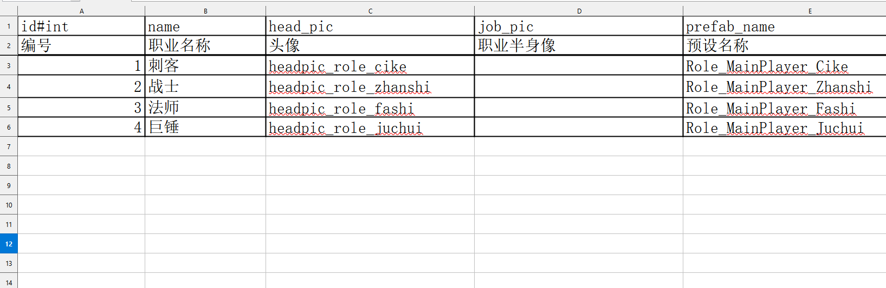

## Install

```bash
git clone https://github.com/suiyuex/hahaconvert
cd hahaconvert

# 编译可执行程序
deno task compile
# 安装为cli
deno task install

#卸载cli
deno task uninstall
```


## Usage

必须存在一个表头行，用于确定列的名称以及列的类型

**默认情况下，表的第一行为表头行，表头行的下一行会被忽略，用于描述每列的行**

导出的文件默认放在源文件同目录下
data/my.ods -> data/my.json

表头行格式`!key[#type]`，如果以`!`开头则不会导出本列

**`#type`可选, 类型默认为string**

类型支持

- int
- float
- bool
- string
- int[]
- float[]
- [] 字符串数组

**数组分隔符为`,`**


### 导出ods/xls/xlsx

不指定`-f`默认导出为json

help

```
hahaconvert export -h
```

导出为json

```bash
hahaconvert export -o ourDir path/to/file.ods

# -o 设置导出的目录
```

如果传入目录，会递归获取目录下所有`*.ods`, `*.xls`, `*.xlsx`文件


导出csharp文件

```bash
# -f 指定为 cs 是必须的
hahaconvert export -f cs sheets

# -csharp-ns 指定文件的命名空间，默认没有
# --csharp-suffix 指定类名/文件名后缀，默认为Config，也就是 Job.ods -> JobConfig.cs with class JobConfig
```


